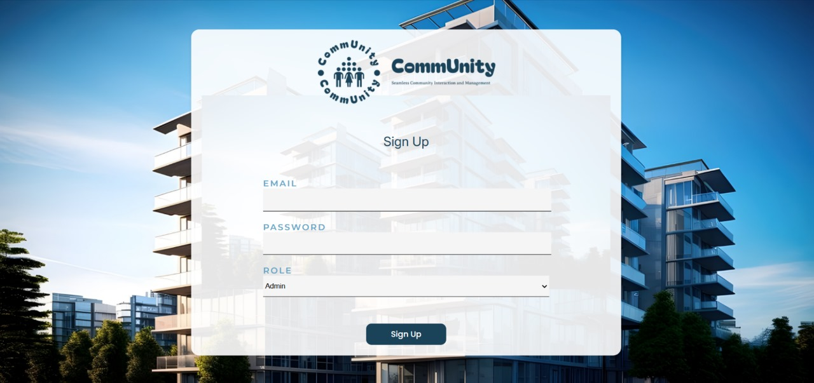
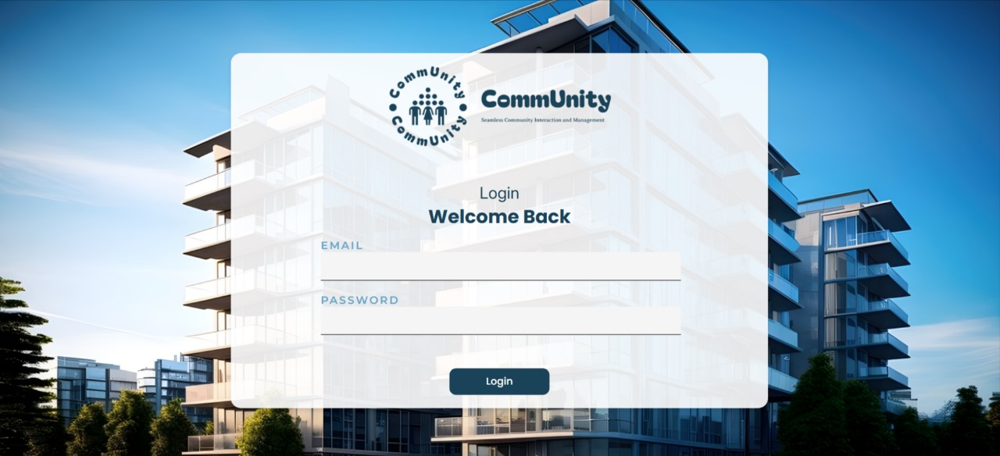
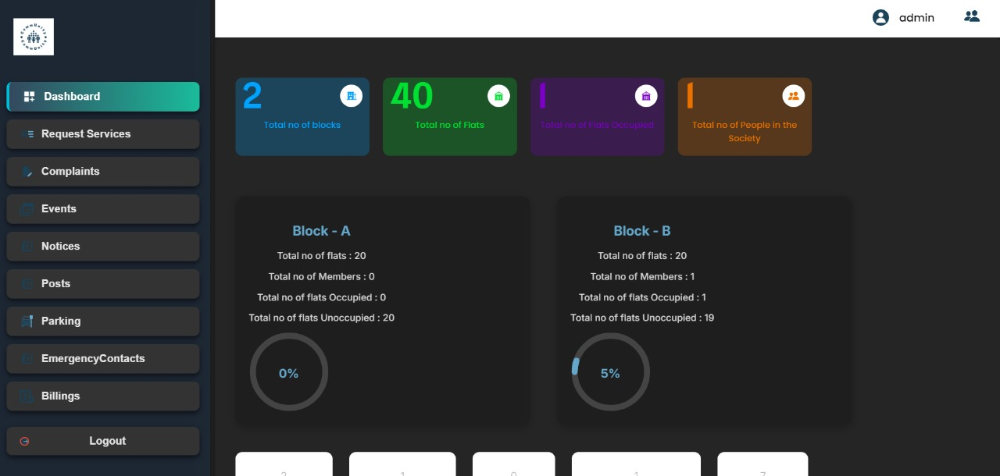
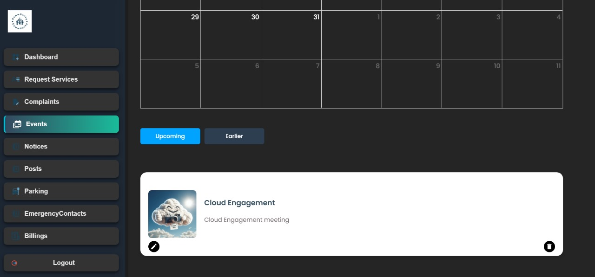
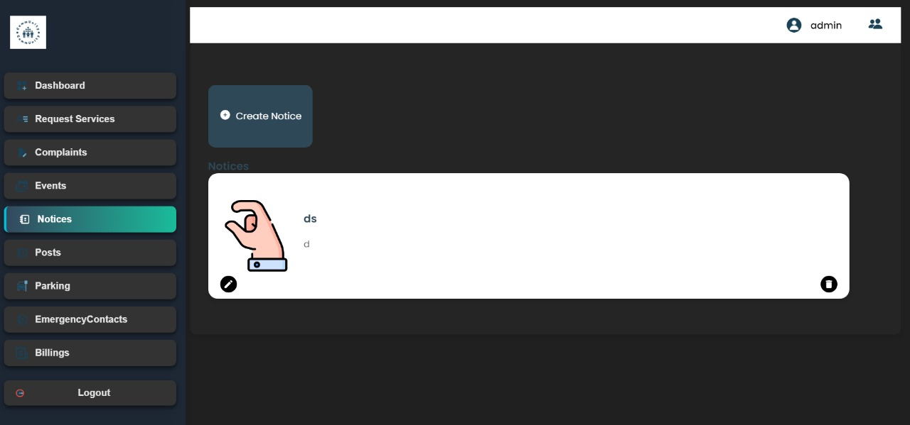
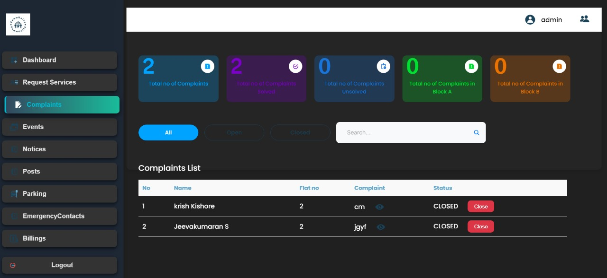
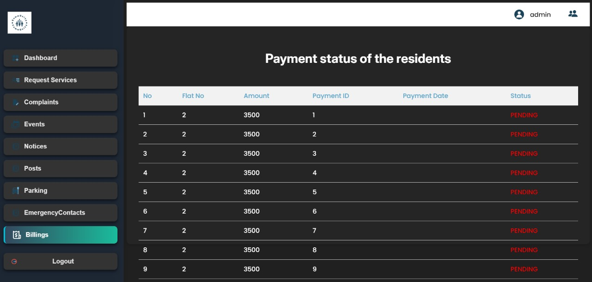
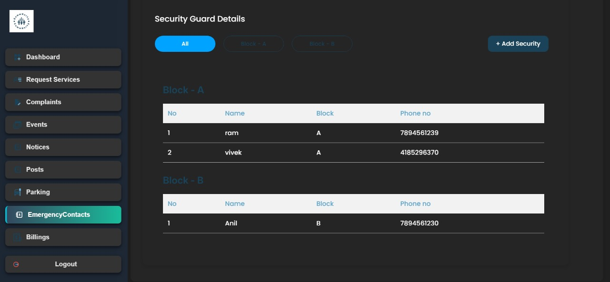
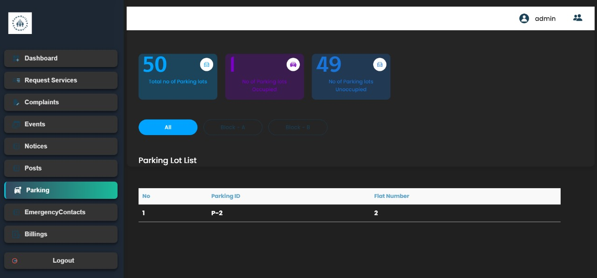

**MILESTONE -1**

**AdminRegistrationPage.js**

-   **Endpoint:**http://localhost:9999/api/community/management-service/societies

-   **HTTP Method:** POST

-   **Purpose:**\
    This endpoint is used to register a society with the community
    management system. It takes in various details like society name,
    address, city, and more, which are provided through the formData
    object.

```{=html}
<!-- -->
```
-   **Response:**

    -   **Success:** Returns a 200 HTTP status, indicating the society
        registration was successful.

    -   **Failure:** Returns an error message (e.g., invalid data or
        token expiration) in JSON format with an appropriate HTTP status
        code.

**Screens Displayed in the Flow**

1.  **Admin Registration Page (Current Screen)**

    -   Displays a form with fields for the user\'s name, phone number,
        and society details.

    -   When the form is submitted, it sends the user data to the
        above-mentioned endpoint.

2.  **Error Message Display**

    -   If the API call fails, an error message is displayed under the
        form. The message is set by setErrorMessage() based on the
        server response.

3.  **Redirection to Login Page**

    -   If the registration is successful (response.ok), the user is
        redirected to the /login page using navigate(\"/login\").

    -   This assumes that the /login route corresponds to a login screen
        where the user can authenticate themselves.

{width="5.71875in"
height="2.7041666666666666in"}

{width="5.71875in" height="2.69375in"}

**LoginPage.js**

1.  **POST http://localhost:9999/auth/login**

    -   **Purpose:** Handles user login by validating the provided email
        and password.

    -   **Response:**

        -   **Success (200):** Returns a JWT token containing user roles
            and other claims.

        -   **Failure (e.g., 401):** Indicates invalid credentials.

    -   **Usage in Code:**

        -   If successful, the token is decoded to determine the user\'s
            role.

        -   The JWT token is stored in cookies for session management.

    -   **Screen Behavior:**

        -   If login succeeds:

            -   Fetches further user details based on the role (ADMIN or
                RESIDENT).

            -   Navigates to different screens based on user data
                availability or role.

        -   If login fails:

            -   Displays an error message on the same login screen.

```{=html}
<!-- -->
```
2.  **GET
    http://localhost:9999/api/community/management-service/societies/by-email/{email}**

    -   **Purpose:** Fetches details of a society associated with the
        ADMIN user\'s email.

    -   **Response:**

        -   **Success (200):** Returns the details of the society.

        -   **Failure (404):** Indicates that the admin user is not
            associated with any society.

    -   **Usage in Code:**

        -   If successful, details are stored in localStorage and the
            user is redirected to the dashboard.

        -   If not found (404):

            -   Redirects to the admin-register screen, prompting the
                user to register the society.

    -   **Screen Behavior:**

        -   **Success:** Redirects to /dashboard.

        -   **Failure:** Redirects to /admin-register for new ADMIN user
            registration.

    -   **Usage in Code:**

        -   If successful, the details are stored in localStorage and
            the user is redirected to the dashboard.

        -   If not found (404):

            -   Redirects to the user-register screen, prompting the
                user to register as a resident.

    -   **Screen Behavior:**

        -   **Success:** Redirects to /dashboard.

        -   **Failure:** Redirects to /user-register for new RESIDENT
            user registration.

```{=html}
<!-- -->
```
3.  **GET
    http://localhost:9999/api/community/management-service/residents/findby-email/{email}**

    -   **Purpose:** Fetches resident details associated with the
        RESIDENT user\'s email.

    -   **Response:**

        -   **Success (200):** Returns the details of the resident,
            including societyId.

        -   **Failure (404):** Indicates the resident is not found in
            the database.

{width="5.71875in" height="2.611111111111111in"}

**MILESTONE-2**

**Dashboard.js**

**1. Residents Information**

-   **URL**:\
    http://localhost:9999/api/community/management-service/residents/findby-societyid/{id}

-   **Purpose**:\
    To fetch details about all residents and administrators in a
    specific society.

-   **Parameters**:

    -   {id}: The id here represents the unique identifier of the
        society whose residents\' data is to be fetched. This is
        extracted from localStorage in the code.

-   **Headers**:

    -   Authorization: A Bearer token retrieved from cookies (jwt_token)
        to ensure that the API request is authenticated.

-   **Response Data**:

    -   An array of objects, where each object contains:

        -   flatNo: Flat number of the resident.

        -   role: Role of the user (e.g., \"ADMIN\" or \"RESIDENT\").

**2. Complaints Data**

-   **URL**:\
    http://localhost:9999/api/community/complaint-service/complaints/by-society/{id}

-   **Purpose**:\
    To fetch all complaints registered by residents in a specific
    society.

-   **Parameters**:

    -   {id}: Society\'s unique identifier.

-   **Headers**:

    -   Authorization: A Bearer token (jwt_token) for authentication.

-   **Response Data**:

    -   An array of complaint objects. Each object might include:

        -   complaintId: Unique ID of the complaint.

        -   description: Details of the complaint.

        -   status: Current status (e.g., \"Pending\", \"Resolved\").

**3.Parking Plots Data**

-   **URL**:\
    http://localhost:9999/api/community/management-service/parking/by-society/{id}

-   **Purpose**:\
    To retrieve information about all parking slots in a specific
    society.

-   **Parameters**:

    -   {id}: Society\'s unique identifier.

-   **Headers**:

    -   Authorization: A Bearer token (jwt_token) for authentication.

-   **Response Data**:

    -   An array of objects, where each object contains:

        -   parkingNo: Identifier of the parking slot.

**4.Vendors Data**

-   **URL**:\
    http://localhost:9999/api/community/complaint-service/vendor/getBySociety/{id}

-   **Purpose**:\
    To retrieve all vendors associated with the society.

-   **Parameters**:

    -   {id}: Society\'s unique identifier.

-   **Headers**:

    -   Authorization: A Bearer token (jwt_token) for authentication.

-   **Response Data**:

    -   An array of objects, where each object represents a vendor\'s
        details.

        -   vendorId: Unique ID of the vendor.

        -   vendorName: Name of the vendor.

        -   serviceType: Type of service provided (e.g., cleaning,
            plumbing).

**5.Security Guards Data**

-   **URL**:\
    http://localhost:9999/api/community/management-service/security-details/get-by-society/{id}

-   **Purpose**:\
    To fetch the details of security personnel assigned to the society.

-   **Parameters**:

    -   {id}: Society\'s unique identifier.

-   **Headers**:

    -   Authorization: A Bearer token (jwt_token) for authentication.

-   **Response Data**:

    -   An array of objects, where each object contains:

        -   guardId: Unique ID of the security guard.

        -   name: Name of the guard.

        -   shift: Guard\'s working shift.

**6.Upcoming Events Data**

-   **URL**:\
    http://localhost:9999/api/community/event-service/event/event-by-society/{id}

-   **Purpose**:\
    To fetch all events related to the society.

-   **Parameters**:

    -   {id}: Society\'s unique identifier.

-   **Headers**:

    -   Authorization: A Bearer token (jwt_token) for authentication.

-   **Response Data**:

    -   An array of event objects. Each object contains:

        -   eventId: Unique ID of the event.

        -   eventName: Name of the event.

        -   eventDate: Scheduled date of the event.

**Appartment.js**

-   **Endpoint:** GET
    /api/community/management-service/residents/findby-societyid/{id}

-   **Purpose:** This endpoint fetches all residents (apartments) within
    a society, identified by the societyId.

-   **Request Headers:**

    -   Authorization: Bearer {jwtToken} - Authorization header
        containing the JWT token for authentication.

    -   Content-Type: application/json - Specifies that the request body
        is in JSON format.

-   **Response:** A list of residents (apartments) associated with the
    society. This is stored in the apartments state.

**Screens Displayed**

> The component renders different views based on the status of the API
> request. The apiStatus state is used to manage the status of the API
> call (INITIAL, IN_PROGRESS, SUCCESS, FAILURE).

1.  **Initial State:**

    -   On initial load, the apiStatus is set to INITIAL, but there\'s
        no explicit view for this state. As the component is mounted, it
        triggers the fetchApartments function.

2.  **Loading View:**

    -   **Condition:** apiStatus === \"IN_PROGRESS\"

    -   **Rendered View:** While the API request is being processed
        (e.g., the data is loading), a loading spinner (RotatingLines)
        is displayed.

    -   **Description:** The spinner indicates to the user that the data
        is being fetched.

3.  **Success View:**

-   **Condition:** apiStatus === \"SUCCESS\"

-   **Rendered View:** Once the API successfully returns the data, the
    component shows the list of apartments based on the selected block.

-   **Description:** The user can see two block buttons (Block A and
    Block B) to filter residents by the block. The PersonCard component
    is used to display details for each resident.

```{=html}
<!-- -->
```
-   **Features in Success View:**

    -   **Block Buttons:** The user can switch between \"Block A\" and
        \"Block B\" to filter the displayed residents.

    -   **Member List:** After filtering by block, the PersonCard
        component is used to display individual details for each
        resident (e.g., name, flat number, phone number, email).

**Failure View:**

-   **Condition:** apiStatus === \"FAILURE\"

-   **Rendered View:** If the API request fails (due to network issues,
    server errors, or invalid data), an error message and a failure
    image are displayed.

-   **Description:** This view informs the user that something went
    wrong and prompts them to try again.

> {width="5.71875in"
> height="2.7270833333333333in"}

**MILESTONE-3**

**Events.js**

1.  **Fetch Events:**

-   **Purpose:** This endpoint retrieves the list of events for a
    specific society.

-   **Method:** GET

-   **Response Data:** A list of events, each containing information
    like event name, description, date, image, etc.

-   **Screen Behavior:** When this request is successful, the events are
    displayed in a calendar and a list format, depending on the filter
    (\"Upcoming\" or \"Earlier\"). If the request fails, an error
    message is shown.

2.  **Create Event (Add Event):**

-   **Purpose:** This endpoint creates a new event for the society by
    sending the event details (name, description, date, image).

-   **Method:** POST

-   **Response Data:** A success message or an error message if event
    creation fails.

-   **Screen Behavior:** When successful, the event is added to the
    event list and calendar. If the event creation fails, an error
    message is shown.

3.  **Update Event (Edit Event):**

-   **Purpose:** This endpoint updates an existing event (i.e., edits an
    event\'s name, date, description, or image).

-   **Method:** PUT

-   **Response Data:** A success message or an error message if event
    update fails.

-   **Screen Behavior:** When successful, the event is updated in the
    list and calendar. If the update fails, an error message is shown.

4.  **Delete Event:**

-   **Purpose:** This endpoint deletes an event by its ID.

-   **Method:** DELETE

-   **Response Data:** A success message or an error message if deletion
    fails.

-   **Screen Behavior:** After successful deletion, the event is removed
    from the list and calendar. If deletion fails, an error message is
    shown.

5.  **Upload Image to Cloudinary:**

-   **Purpose:** This endpoint uploads an image to Cloudinary, which is
    then used in event creation or editing.

-   **Method:** POST

-   **Response Data:** The image URL upon successful upload or an error
    message if the upload fails.

-   **Screen Behavior:** If the image upload succeeds, the image URL is
    stored, and the event is created or updated with that image. If it
    fails, an error message is displayed.

**Screens Displayed Based on API Response:**

1.  **Loading State:**

    -   If the API request is in progress (i.e., apiStatus ===
        \'IN_PROGRESS\'), a loading spinner (from RotatingLines
        component) is displayed.

2.  **Success View:**

    -   If the API request is successful (i.e., apiStatus ===
        \'SUCCESS\'), the following elements are shown:

        -   **Calendar:** The FullCalendar component displays events on
            a calendar.

        -   **Event List:** Events are listed with options to view,
            edit, or delete.

        -   **Add Event Button:** If the user has the \"ADMIN\" role,
            they can click this button to add a new event.

        -   **Event Cards:** Events are displayed with their details
            (name, date, description, image) in individual Card
            components. Each card has options for editing, deleting, or
            providing feedback.

3.  **Failure View:**

    -   If the API request fails (i.e., apiStatus === \'FAILURE\'), an
        error message with an image is shown to the user, indicating
        that something went wrong during the request.

4.  **Add/Edit Event Modal:**

    -   A modal is displayed for both adding a new event and editing an
        existing event. It includes fields for:

        -   **Event Name** (text input)

        -   **Event Date/Time** (datetime-local input)

        -   **Event Description** (textarea)

        -   **Event Image** (file input)

    -   The modal has buttons to either \"Add Event\" (for new events)
        or \"Save Changes\" (for edited events).

5.  **Event Detail View (Feedback):**

    -   A \"feedback\" feature allows users to navigate to a feedback
        form for specific events using the feedback function, which
        directs them to the /feedback/{id} route.

{width="5.71875in" height="2.667361111111111in"}

**NoticePage.js**

**API Endpoints Used:**

1.  **Fetch Notices:**

    -   **Endpoint:**
        http://localhost:9999/api/community/event-service/notice/notice-by-society/{id}

    -   **Method:** GET

    -   **Description:** This endpoint fetches the list of notices for a
        specific society. The {id} in the URL is the society ID, which
        is retrieved from local storage.

    -   **Response:** A list of notices, each containing fields such as
        noticeId, heading (title), content (description), datePosted
        (date), and noticeImage (image URL).

    -   **Use:** The fetchNotices function fetches notices and updates
        the state with the fetched data.

2.  **Create Notice:**

    -   **Endpoint:**
        http://localhost:9999/api/community/event-service/notice/create-notice

    -   **Method:** POST

    -   **Description:** This endpoint is used to create a new notice.
        It requires a JSON payload with the fields heading (title),
        content (description), noticeImage (image URL), and societyId
        (the ID of the society).

    -   **Response:** A success or failure response.

    -   **Use:** The handleAddNotice function sends a request to create
        a new notice, including uploading the image to Cloudinary first.

3.  **Update Notice:**

    -   **Endpoint:**
        http://localhost:9999/api/community/event-service/notice/update-notices/{noticeId}

    -   **Method:** PUT

    -   **Description:** This endpoint is used to update an existing
        notice. The {noticeId} in the URL refers to the specific notice
        being edited. The body of the request contains updated fields,
        such as heading, content, noticeDate, and noticeImage.

    -   **Response:** A success or failure response.

    -   **Use:** The handleEditNotice function sends a request to update
        an existing notice with the modified data.

4.  **Delete Notice:**

    -   **Endpoint:**
        http://localhost:9999/api/community/event-service/notice/delete-notices/{noticeId}

    -   **Method:** DELETE

    -   **Description:** This endpoint deletes a specific notice using
        its noticeId.

    -   **Response:** A success or failure response.

    -   **Use:** The handleDeleteNotice function sends a request to
        delete a notice.

**Screens That Would Be Displayed:**

1.  **Loading Screen (when API is being called):**

    -   If the API request is still in progress (the apiStatus is set to
        IN_PROGRESS), a loading spinner (RotatingLines) is displayed.

    -   **Screen Content:** The screen will show a rotating loader
        indicating that data is being fetched.

2.  **Success Screen (when data is successfully fetched):**

    -   If the API call to fetch notices is successful (apiStatus is set
        to SUCCESS), the list of notices is displayed in a structured
        format.

    -   **Screen Content:**

        -   A \"Create Notice\" button for admins, which opens a modal
            to add a new notice.

        -   A list of notices, each displayed in a Card component, which
            shows:

            -   Notice title (Heading)

            -   Description

            -   Date and time (formatted)

            -   Image (if available)

        -   Each notice has options to edit or delete it (depending on
            the user\'s role).

3.  **Failure Screen (when the API call fails):**

    -   If the API request fails (the apiStatus is set to FAILURE), an
        error screen is displayed with a message.

    -   **Screen Content:**

        -   An image indicating failure along with a message: \"Oops!
            Something Went Wrong,\" and a suggestion to try again later.

4.  **Modal for Adding or Editing Notices:**

    -   A modal pops up when the \"Create Notice\" button is clicked
        (for adding a new notice) or when the \"Edit\" button for an
        existing notice is clicked.

    -   **Screen Content (for Add/Edit):**

        -   A form where the user can enter the notice details:

            -   Input field for the title (heading) of the notice.

            -   File upload for the notice image.

            -   A text area for the notice description.

        -   The modal allows either adding a new notice or editing an
            existing one, based on whether editNoticeId is set or not.

5.  **Edit and Delete Actions:**

Each notice displayed has \"Edit\" and \"Delete\" options. Clicking on
\"Edit\" opens the modal pre-filled with the notice\'s current data,
allowing changes. Clicking on \"Delete\" removes the notice.

{width="5.71875in"
height="2.6777777777777776in"}

**RequestsPage.js**

**API Endpoints**

1.  **Fetch Vendors (GET)**

    -   **Endpoint**:http://localhost:9999/api/community/complaint-service/vendor/getBySociety/\${data.id}

    -   **Description**: This endpoint is used to fetch a list of
        vendors for a specific society. The data.id refers to the unique
        ID of the society (retrieved from localStorage).

    -   **Headers**:

        -   Authorization: The JWT token retrieved from
            Cookies.get(\"jwt_token\") is passed in the request header.

    -   **Response**:

        -   If successful, it returns a list of vendors.

        -   The list is filtered by the serviceType (e.g., maintenance,
            plumbing, etc.), and the unique types of services are
            extracted.

    -   **Status**: The component uses apiStatus to manage loading and
        error states while fetching vendors.

2.  **Create Request (POST)**

    -   **Endpoint**:http://localhost:9999/api/community/complaint-service/request/create-request

    -   **Description**: This endpoint is used to create a new service
        request (complaint) for a given society. It sends a POST request
        with the details of the request such as:

        -   serviceType: The type of service requested.

        -   address: The address where the service is needed.

        -   phoneNo: The phone number for contact.

        -   description: Additional notes or details about the request.

    -   **Headers**:

        -   Authorization: The JWT token is passed here as well.

    -   **Body**:

        -   The body contains the details required to create a new
            service request.

    -   **Response**:

        -   If the request is successful, the user is notified with a
            success message (toast.success(\"Request sent
            successfully!\")).

        -   If it fails, an error message is displayed, and the form
            inputs are retained for corrections.

**Screens Displayed**

Based on the API responses and the state of the apiStatus, different
screens are rendered.

1.  **Loading State (While fetching vendors or sending request)**:

    -   **Condition**: When the apiStatus is inProgress.

    -   **Displayed Screen**:

        -   A loading spinner is shown using the RotatingLines component
            from react-loader-spinner. This indicates that the system is
            either fetching the vendors or sending the service request.

        -   The spinner is centered on the screen inside the
            loader-container.

2.  **Success State (Vendors fetched, Request sent successfully)**:

    -   **Condition**: When the apiStatus is success.

    -   **Displayed Screen**:

        -   **Service Type Selection**: A list of buttons representing
            the unique service types is displayed. The user can select
            the type of service they need.

        -   **Request Form**: A form to input service details such as
            address, phone number, and description is shown. Upon
            submitting, the request is sent to the server via the API,
            and a success message is displayed.

        -   **Vendors List**: After submitting the request, a list of
            filtered vendors is displayed based on the selected service
            type. These vendors are shown via the VendorList component.

        -   **Image**: An image is displayed on the right side (using an
            img tag).

3.  **Failure State (Error while fetching vendors or sending request)**:

    -   **Condition**: When the apiStatus is failure.

    -   **Displayed Screen**:

        -   An error message is shown. This includes an image
            representing a failure and a message prompting the user to
            try again.

        -   **Error Details**: The error is described as "We are having
            some trouble processing your request. Please try again."

**VentorList.js**

**API Endpoints**

1.  **Fetch Vendor List (GET)**:

-   **Endpoint**:
    <http://localhost:9999/api/community/complaint-service/vendor/getAll>

-   The VendorList component takes in the vendors prop, which contains a
    list of vendors. This data is passed down from the parent component,
    so there is no explicit API call shown here for fetching vendors.
    The list of vendors could be fetched from an API on the parent
    component

-   This endpoint could return an array of vendor objects with fields
    like id, name, service, company, phoneNo, and email.

2.  **Add Vendor (POST)**:

-   **Endpoint**:http://localhost:9999/api/community/complaint-service/vendor/create

-   **Description**: This endpoint is used when an administrator adds a
    new vendor to the system via the modal. It expects a POST request
    with a body containing the details of the vendor:

    -   name: Vendor name

    -   company: Vendor\'s company name

    -   service: Type of service the vendor offers

    -   phoneNo: Vendor\'s phone number

    -   email: Vendor\'s email address

    -   societyId: ID of the society to which this vendor belongs

```{=html}
<!-- -->
```
-   **Headers**:

    -   Authorization: The request is authenticated using a JWT token
        passed in the header.

```{=html}
<!-- -->
```
-   **Response**: If successful, the vendor is added to the system. If
    there's an error, an error message is displayed in the UI (set in
    the errorMessage state).

**Screens Displayed**

1.  **Vendor Summary Section**:

    -   **Description**: The top part of the page displays a summary of
        the vendors\' services. The calculateVendorSummary function
        calculates the number of unique services based on the vendors\'
        data and displays it in a card format using VendorSummaryCard
        components.

    -   **Displayed Screen**: A series of VendorSummaryCard components,
        each representing a summary of the vendor services.

2.  **Vendor List Table**:

    -   **Description**: Below the summary, a table is rendered
        displaying a list of all the vendors. Each vendor is listed with
        details like:

        -   Vendor\'s number (serial number)

        -   Vendor\'s name

        -   Vendor\'s service type

        -   Vendor\'s company

        -   Vendor\'s phone number

    -   This table displays data dynamically from the vendors array
        passed as a prop.

    -   **Displayed Screen**: A table with columns: **No**, **Name**,
        **Service**, **Company**, and **Phone No**. Each row represents
        a vendor.

3.  **Add Vendor Modal**:

    -   **Condition**: This modal is visible only when the user is an
        \"ADMIN\" (checked by the role prop).

    -   **Displayed Screen**:

        -   A button labeled \"Add Vendor\" allows the admin to open a
            modal to add a new vendor.

        -   When the modal is shown, the user can fill out the vendor
            details such as name, company, service, phone number, and
            email. Additionally, an image upload input allows admins to
            upload an image for the vendor.

        -   The form is submitted by clicking the **Save** button, which
            triggers the handleSubmit function to send the vendor data
            to the API using the POST method.

        -   If there is an error, an error message is shown inside the
            modal.

        -   The modal can be closed by clicking the **Cancel** button or
            the close icon (\<MdClose /\>).

    -   **Modal Elements**:

        -   File upload for vendor image.

        -   Inputs for name, company, service, phone number, and email.

        -   Action buttons for canceling or saving the data.

        -   Error message display if submission fails.

4.  **Error Handling**:

    -   **Condition**: If there is any error while adding a vendor (like
        a failed API request), an error message is shown inside the
        modal. This is set using the errorMessage state.

{width="5.71875in"
height="2.6798611111111112in"}

**Complaints.js**

**API Endpoints:**

1.  **Fetching Complaints**:

    -   **Endpoint**:

        -   For an ADMIN role: GET
            http://localhost:9999/api/community/complaint-service/complaints/by-society/{id}

        -   For a RESIDENT role: GET
            http://localhost:9999/api/community/complaint-service/complaints/by-resident/{residentId}

    -   **Description**: This fetches the list of complaints either by
        society or by resident, based on the user's role. The role
        (ADMIN or RESIDENT) is determined by the value stored in the
        Cookies and is used to decide which endpoint to call.

    -   **Screen Displayed**: The list of complaints is displayed in a
        table format, showing columns for complaint number, name, flat
        number, complaint title, and status.

2.  **Updating Complaint Status (Closing Complaint)**:

    -   **Endpoint**: PUT
        http://localhost:9999/api/community/complaint-service/complaints/update-complaint/{complaintId}

    -   **Description**: This endpoint is called when an ADMIN user
        closes a complaint. The status of the complaint is updated to
        CLOSED.

    -   **Screen Displayed**: The complaint\'s status is updated in the
        complaints list. A \"Close\" button appears next to each
        complaint for an ADMIN user, and the button is disabled if the
        complaint is already closed.

3.  **Creating a New Complaint**:

    -   **Endpoint**: POST
        http://localhost:9999/api/community/complaint-service/complaints/create-complaint

    -   **Description**: This endpoint allows RESIDENT users to create
        new complaints. The complaint includes the person's name, title,
        description, and other necessary details.

    -   **Screen Displayed**: A form for submitting a new complaint is
        displayed for RESIDENT users. The form includes fields for the
        person's name, complaint title, and description. After
        submitting, the new complaint is added to the complaints list.

**Screens Displayed:**

1.  **Complaints Dashboard (Admin/Resident)**:

    -   Displays a summary of complaints (total, solved, unsolved,
        categorized by block A/B).

    -   A filter option (All, Open, Closed) is available to filter the
        complaints.

    -   A search bar allows searching complaints by title.

    -   A table of complaints with columns for complaint number, name,
        flat number, title, and status.

2.  **Complaint Details (Modal)**:

    -   When a user clicks the eye icon next to a complaint\'s title, a
        modal appears displaying detailed information about the selected
        complaint. This includes:

        -   Name of the person who raised the complaint

        -   Flat number

        -   Complaint title and description

        -   Status (either \"Open\" or \"Closed\")

3.  **Complaint Creation (For Residents)**:

    -   A form for creating a new complaint appears for RESIDENT users.
        The form includes:

        -   Name input

        -   Title input

        -   Description input

        -   Submit button to create the complaint

4.  **Loading & Error Screens**:

    -   **Loading View**: When data is being fetched from the API, a
        rotating loader is displayed.

    -   **Error View**: If there's an issue fetching or processing data,
        an error message with an image appears on the screen, informing
        the user that something went wrong.

{width="5.71875in" height="2.627083333333333in"}

**MILESTONE-4**

**BillingPage.**js

1.  **Fetching Payment Status for a Specific Resident (Resident\'s
    View):**

-   **Endpoint:** GET /api/community/payment/{flatNo}/{societyId}

```{=html}
<!-- -->
```
-   **Purpose:** Fetch the payment status of a specific resident's flat
    (using flatNo and societyId).

-   **Headers:**

```{=html}
<!-- -->
```
-   Authorization: Bearer {jwtToken} - The JWT token is used for
    authenticating the request.

```{=html}
<!-- -->
```
-   **Response:** The status of the resident's payment (e.g.,
    \"PENDING\" or \"PAID\").

2.  **Fetching All Payments for a Society (Admin\'s View):**

-   **Endpoint:** GET /api/community/payment/{flatNo}/{societyId}

-   **Purpose:** Fetch the payment details (status, amount, etc.) for
    all residents in a particular society.

-   **Headers:**

    -   Authorization: Bearer {jwtToken} - The JWT token is used for
        authenticating the request.

-   **Response:** A list of payment statuses for all residents, which
    includes the flatNo, amount, paymentId, paymentDate, and status.

3.  **Updating Payment Status (Resident\'s Payment Update):**

-   **Endpoint:** PUT /api/community/payment/update/{flatNo}/{societyId}

-   **Purpose:** Update the payment status to \"PAID\" once the resident
    completes the payment.

-   **Headers:**

```{=html}
<!-- -->
```
-   Authorization: Bearer {jwtToken} - The JWT token is used for
    authenticating the request.

```{=html}
<!-- -->
```
-   **Response:** The status is updated, and the new status is reflected
    in the frontend.

4.  **Creating a New Payment (Resident Initiates Payment):**

-   **Endpoint:** POST /api/community/payment/create

-   **Purpose:** Create a new payment for the resident by initiating the
    payment process (e.g., through a payment gateway like Razorpay).

-   **Headers:**

    -   Authorization: Bearer {jwtToken} - The JWT token is used for
        authenticating the request.

-   **Body:**

    -   The body includes the payment details, such as the amount,
        description (e.g., maintenance bill), and resident details
        (email, phone number).

-   **Response:** A payment link is generated, and the resident is
    redirected to the payment gateway.

**UI Screens Based on Role**

1.  **Resident\'s View:**

-   **When apiStatus === \"inProgress\":**

```{=html}
<!-- -->
```
-   A loading spinner (RotatingLines) is displayed to indicate that the
    data is being fetched.

```{=html}
<!-- -->
```
-   **When apiStatus === \"success\":**

```{=html}
<!-- -->
```
-   The resident sees the current payment status for their flat.

-   If the payment is already marked as \"PAID\", the \"Pay Now\" button
    is disabled, and a message \"Payment Completed\" is displayed in a
    greyed-out button.

-   If the payment is still \"PENDING\", the \"Pay Now\" button is
    active, and the resident can initiate the payment process.

```{=html}
<!-- -->
```
-   **When apiStatus === \"failure\":**

```{=html}
<!-- -->
```
-   An error message is displayed, informing the user that something
    went wrong while fetching the payment data

**2 Admin\'s View:**

-   **When apiStatus === \"success\":**

    -   The admin can see a table listing all residents\' payments,
        showing the flat number, amount, payment ID, payment date, and
        status (either \"PENDING\" or \"PAID\").

```{=html}
<!-- -->
```
-   **When apiStatus === \"failure\":**

```{=html}
<!-- -->
```
-   An error message is displayed, informing the admin that something
    went wrong while fetching the payment data.

{width="5.71875in" height="2.725in"}

**EmergencyConPage**.js

**API Endpoints:**

1.  **Fetching Emergency Contacts:**

    -   **Endpoint:** GET
        http://localhost:9999/api/community/management-service/emergency-contacts/get-by-society/{id}

    -   **Description:** This API fetches emergency contact details
        based on the societyId, which is retrieved from the local
        storage (via data.id). The request includes the JWT token for
        authentication in the Authorization header.

    -   **Usage in Code:** It is called within the fetchDetails()
        function to retrieve the list of emergency contacts. Upon
        successful response, the contact data is stored in the contacts
        state.

    -   **Response:** It returns a list of emergency contacts with
        details like name, service type, and phone number.

    -   **Status Handling:** Displays a loading spinner (RotatingLines)
        while fetching, an error message if fetching fails, and the
        contact list when successful.

2.  **Adding a New Emergency Contact:**

    -   **Endpoint:** POST
        http://localhost:9999/api/community/management-service/emergency-contacts

    -   **Description:** This API adds a new emergency contact to the
        system. The request body includes the details like personName,
        serviceType, phoneNo, and societyId. The JWT token is also
        included in the Authorization header for authentication.

    -   **Usage in Code:** Triggered by the handleAddContacts() function
        when the user fills in the form and clicks the \"Save\" button.
        After the contact is successfully added, the form resets, and
        the contact list is refreshed by calling fetchDetails().

    -   **Response:** It creates a new emergency contact and returns a
        success or failure status.

    -   **Status Handling:** If successful, the modal is closed, and the
        list of contacts is updated. If there is an error, an error
        message is displayed.

3.  **Deleting an Emergency Contact:**

    -   **Endpoint:** DELETE
        http://localhost:9999/api/community/management-service/emergency-contacts/delete-emergency-contact/{emergencyId}

    -   **Description:** This API deletes an emergency contact by its
        unique ID (emergencyId). The request includes the JWT token for
        authentication.

    -   **Usage in Code:** Triggered when the user clicks the delete
        button (trash icon) next to a contact. The
        handleDeleteContacts() function is called with the emergencyId
        of the contact to be deleted.

    -   **Response:** It deletes the selected emergency contact and
        returns a success or failure status.

    -   **Status Handling:** Upon success, the contact is removed from
        the list, and the contacts are re-fetched.

**Screens Displayed:**

1.  **Initial State (Loading State):**

    -   When the component first loads or when the API request is in
        progress, the screen displays a loading spinner (RotatingLines).
        This is done inside the renderLoadingView() function, which is
        invoked when the apiStatus is inProgress.

2.  **Error State (Failure State):**

    -   If the API request fails (e.g., due to network issues or server
        errors), an error message is shown. This is handled in the
        renderFailureView() function. The screen will display an image
        and a message saying, \"Oops! Something Went Wrong.\"

3.  **Success State:**

    -   Once the data is successfully fetched, the screen displays a
        table with a list of emergency contacts. Each contact has
        details like No, Name, Service, and Phone no. If the user has an
        ADMIN role, an \"Add Contact\" button is displayed.

    -   If the user clicks on the \"Add Contact\" button, a modal
        appears allowing the user to input the details of the new
        emergency contact.

    -   If the user clicks the trash icon (MdDelete), the selected
        contact is deleted, and the contact list is updated.

    -   If a contact is added or deleted successfully, the contact list
        is refreshed to reflect the changes.

4.  **Modal for Adding Emergency Contact:**

    -   When the \"Add Contact\" button is clicked, a modal is displayed
        with fields to input the serviceType, name, and phoneNo of the
        new emergency contact. The modal has \"Save\" and \"Cancel\"
        buttons. Clicking \"Save\" calls the API to add the contact, and
        clicking \"Cancel\" closes the modal without making changes.

5.  **Side and Top Navbar:**

    -   The component also displays a SideNavbar and a TopNavbar at the
        top. The top navbar displays the heading \"Emergency Contacts,\"
        which helps users know which section they are in.

-   **Response Data:** The image URL upon successful upload or an error
    message if the upload fails.

-   **Screen Behavior:** If the image upload succeeds, the image URL is
    stored, and the event is created or updated with that image. If it
    fails, an error message is displayed.

{width="5.71875in"
height="2.6506944444444445in"}

**Parking.js**

**Endpoint:**http://localhost:9999/api/community/management-service/parking/by-society/{id}

**Explanation:**

-   **http://localhost:9999**: This is the base URL of the local server
    where the backend is running.

-   **/api/community/management-service/parking/by-society/{id}**: This
    is the specific endpoint that fetches parking information for a
    society. The {id} parameter is dynamically replaced with the id of
    the society.

-   **Authorization**: The request includes a JWT token from cookies
    (Authorization: Bearer \${jwtToken}) to authenticate the user and
    ensure they have access to the data.

-   **Response**: This endpoint returns parking data for the society,
    which is filtered to exclude entries starting with \"P-ADMIN\"
    (i.e., administrative parking spots).

**Flow of Screens Based on API Status:**

The screens are dynamically rendered based on the API response status.
Here\'s how each state is handled:

1.  **Initial State (INITIAL)**:

    -   The API request is not yet made, so no specific content is
        shown. The screen will remain empty until the data is fetched.

2.  **Loading State (IN_PROGRESS)**:

    -   While the data is being fetched from the API, the screen
        displays a **loading spinner** (RotatingLines component).

    -   This is visible to the user as a placeholder until the data
        arrives or fails.

3.  **Success State (SUCCESS)**:

    -   If the API fetch is successful, the following screens are
        displayed:

        -   **Parking Summary**: A summary of parking data showing the
            total number of parking lots, the number of occupied lots,
            and unoccupied lots. This is shown using the
            VendorSummaryCard component for each type of summary, with
            different colors.

        -   **Parking Lot List**: A table displaying a list of parking
            slots. The table includes:

            -   **Parking ID**: Unique identifier for each parking slot.

            -   **Flat Number**: The flat number assigned to each
                parking slot.

        -   **Filter Controls**: The user can filter the list by
            \"All\", \"Block - A\", or \"Block - B\". This is managed by
            the activeFilter state, which controls which block's data to
            show.

4.  **Failure State (FAILURE)**:

    -   If the API fetch fails (e.g., due to a server issue), an **error
        view** is displayed, which includes:

        -   An image showing that something went wrong (failure-img).

        -   A message indicating that there was an issue with the
            request and the user should try again.

{width="5.71875in" height="2.66875in"}

**PostRecPage.js**

1.  **Fetching Posts (GET request):**

-   **EndPoint:** GET
    http://localhost:9999/api/community/event-service/post/by-society/{id}

-   **Purpose**: This API is used to fetch posts from a community or
    society. The {id} is a dynamic parameter that corresponds to the id
    of the society, which is retrieved from localStorage (specifically
    from the data object).

-   **Process**: When the component is mounted, the fetchPosts function
    is called, making a request to this endpoint with the society\'s id
    and the JWT token for authentication.

-   **Response**: It returns an array of posts, including the title,
    description, image, and like count for each post. This data is then
    formatted and stored in the posts state.

**2 Creating a Post (POST request)**

-   **Endpoint**:POST
    http://localhost:9999/api/community/event-service/post/create-post

-   **Purpose**: This API is used to create a new post in the community.
    It accepts a POST request with details such as the title, content
    (description), and image URL of the post.

-   **Process**: When the user enters details for a new post and clicks
    on \"Create Post,\" the handleAddPost function is called. It uploads
    the image to Cloudinary using the handleImageUpload function, then
    sends a request to create the post. The data for the post (including
    the uploaded image URL) is sent in the request body.

-   **Response**: A successful response means the post is created, and
    the modal closes. The post list is refreshed by calling fetchPosts
    again.

**3 Updating a Post (PUT request)**

-   **Endpoint**:PUThttp://localhost:9999/api/community/eventservice/post/update/{postId}

-   **Purpose**: This API is used to update an existing post. The
    {postId} is a dynamic parameter that corresponds to the id of the
    post being updated.

-   **Process**: When the user clicks on the \"Edit\" button, the post
    data is loaded into the modal for editing. After making changes, the
    user clicks \"Save Changes,\" which triggers the handleEditPost
    function. This function uploads the new image (if changed) and sends
    a PUT request to update the post.

-   **Response**: A successful response updates the post and triggers a
    refresh of the post list via fetchPosts.

**4 Deleting a Post (DELETE request)**

-   **Endpoint**:DELETE
    http://localhost:9999/api/community/event-service/post/delete/{postId}

-   **Purpose**: This API is used to delete an existing post. The
    {postId} is a dynamic parameter that corresponds to the id of the
    post being deleted.

-   **Process**: The user can click on the \"Delete\" button for a post.
    This triggers the handleDeletePost function, which sends a DELETE
    request to remove the post from the backend.

-   **Response**: A successful response deletes the post, and the list
    is refreshed to reflect the changes.

**Screens Displayed Based on the Code:**

1.  **Main Posts Screen (PostsMainPage Component)**:

-   Displays a list of posts fetched from the backend API.

-   Shows a button to \"Create Post\" if the user has an \"ADMIN\" role.

-   Allows the user to edit or delete posts (if they are the creator or
    have admin privileges).

2.  **Modal for Creating/Editing Post**:

-   This modal is shown when the user clicks on \"Create Post\" or
    \"Edit\" for an existing post.

-   The modal allows the user to:

-   Upload an image (preview it before submitting).

-   Enter the title and description for the post.

-   Either create a new post or save changes to an existing one.

-   The modal is triggered by the showModal state.

3.  **Loading State**:

-   While data is being fetched from the API, a loading spinner
    (RotatingLines) is displayed.

4.  **Error State**:

-   If the API request fails, an error message is displayed to the user
    with an option to try again.
